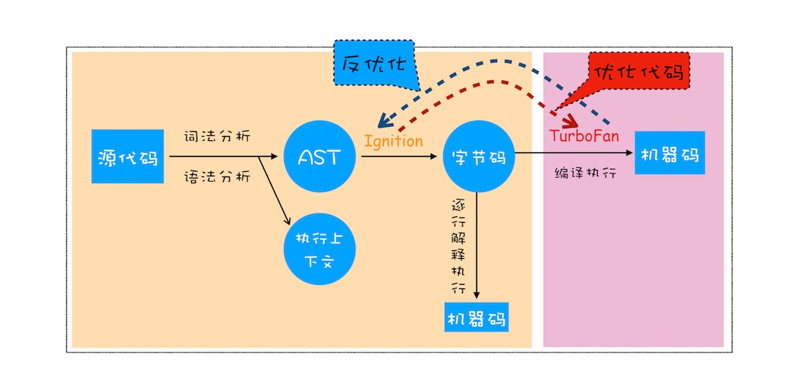

# 作用域是什么

- react MVVM鼻祖 setState state 状态机制  数据驱动页面  逻辑UI分离
    1. 变量：程序的状态  声明空间(闭包,作用域,变量查找,变量提升)  存储值
    2. 值: 修改 状态改变 页面重新渲染
- 赋值过程
    var a = 2; 他运行的背后是什么?
    var: 关键字   a: identifier 标识符   =: 运算符  2: value literal
    1. 高级语言 cpu无法理解无法执行
    2. 
## 编译原理
- 语言执行底层
    操作系统 -> 编译原理
    v8 引擎  编译器/解译器
    1. 分词/词法分析
    - [ var, a, =, 2 ] 分成一个个 token  
    最后形成二进制文件
    2. 语法分析阶段
    - 构建一个"抽象语法树(AST,Abstract Syntax Tree)" html中

形成结构 形成一棵dom树
    编译器也是一段代码 执行每一个 token
    3. 代码生成
    - java c++ 可以预编译
      js 运行时编译
    - v8引擎如何执行一段代码
    
    - 编译器(Comliler) 解释器(Interpreter)
    - JIT (即时编译器)